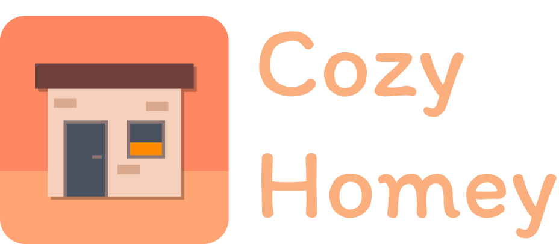
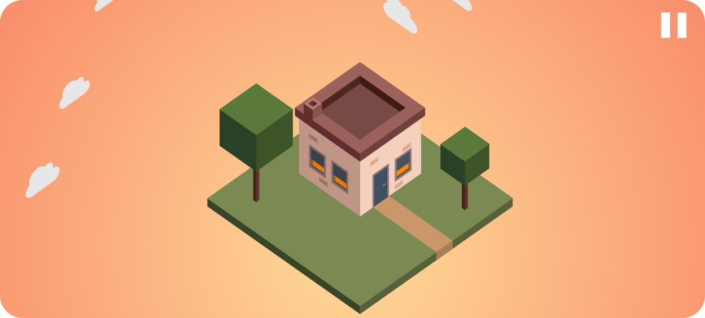
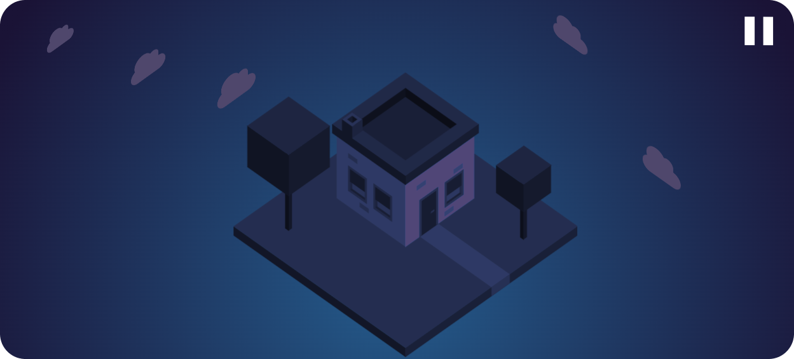
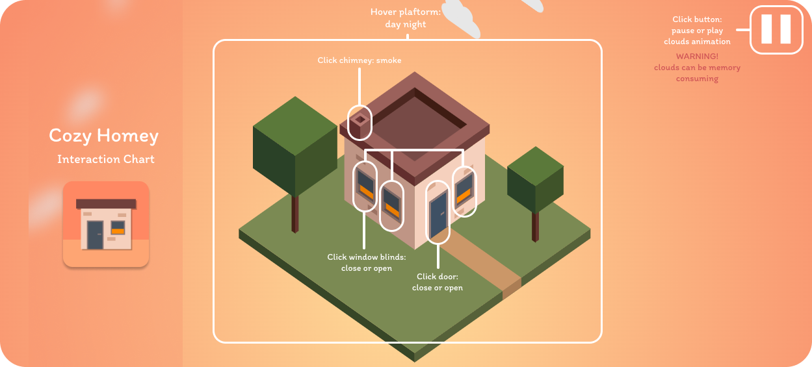

# About Cozy Homey

Side note: This repository is meant for study purposes for the minor web development offered at The Hogeschool van Amsterdam also known as University of Applied Sciences. If you're not a teacher or a fellow student, then it's probably not that interesting to look at this repository.

Cozy Homey is a cozy little house in the middle of nowhere, which you can partly interact with. You can experience Cozy Homey during the day (day mode) and during the night (dark mode). It's typically day once you hover over the platform and it's night when your cursor is off the platform.

A view sights of Cozy Homey:

## Interactions

There are several interactions for Cozy Homey. All the interactions can be seen on the interaction chart:

WARNING: clouds can be memory consuming.

## The Process

You can read all about my process in dutch on the [wiki of this repository](https://github.com/rvdegroen/css-to-the-rescue-2223/wiki).

# Installation

To install my application, you just have to follow the following steps:

1. Clone this repository on your local machine with `git clone https://github.com/rvdegroen/css-to-the-rescue-2223.git` in your terminal of choice.
2. To use the application, simply drag the `index.html` that's within the `eindopdracht` folder and drag it into your browser.

You can find Cozy Homey in the `eindopdracht` folder and it's immediately ready to use.
